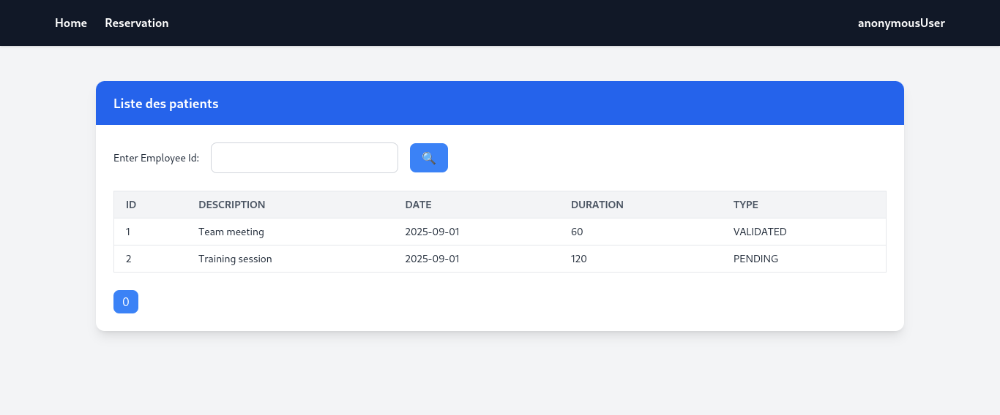

# Hospital Room Reservation System

This is a Spring Boot application for managing enterprise room reservations, employees, and equipment. It features user authentication, role-based access control, and a web interface built with Thymeleaf and TailwindCSS.

## Features

- Employee and room management
- Equipment management
- Reservation creation and listing
- Role-based access (Admin/User)
- Secure login/logout (Spring Security)
- Pagination and search for reservations
- Responsive UI with Thymeleaf templates

## Technologies Used

- Java 23
- Spring Boot 3.4.3
- Spring Data JPA
- Spring Security
- Thymeleaf
- TailwindCSS & Bootstrap
- MySQL (default) or H2 (runtime)
- Maven

## Getting Started

### Prerequisites

- Java 23+
- Maven
- MySQL (or use H2 for testing)

### Configuration

Edit [`src/main/resources/application.properties`](src/main/resources/application.properties) to set your database credentials.

### Build & Run

```sh
./mvnw spring-boot:run
```

The application will start on [http://localhost:8085](http://localhost:8085).

### Default Users

- **Admin:**  
  Username: `admin`  
  Password: `0000`  
  Roles: `USER`, `ADMIN`

- **User:**  
  Username: `u1`  
  Password: `0000`  
  Role: `USER`

## Project Structure

- `src/main/java/ma/enset/exam1/Dao/Entities/` - JPA entities
- `src/main/java/ma/enset/exam1/Dao/Repository/` - Spring Data repositories
- `src/main/java/ma/enset/exam1/Dto/` - DTOs and mappers
- `src/main/java/ma/enset/exam1/Service/` - Service layer
- `src/main/java/ma/enset/exam1/Web/` - Controllers
- `src/main/resources/templates/` - Thymeleaf HTML templates

## Screenshots

- **Login Page:**  
  
- **Home Page:**  
  
- **Reservation Form:**  
  

---
Copyright © 2025, All Rights Reserved For ELKADDI-Solutions
